# Sistem Pelaporan Pengaduan Layanan Masyarakat

Dibuat sebagai wadah untuk menyampaikan keluhan, aspirasi dan laporan kejadian di sekitar anda.

## Tour

1. Relasi Tabel pada Database
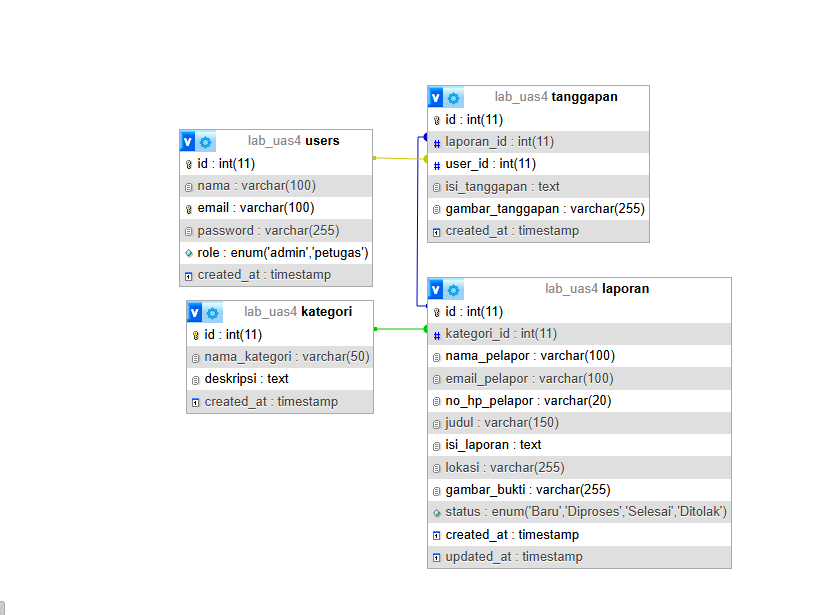

2. Tembak pakai postman 
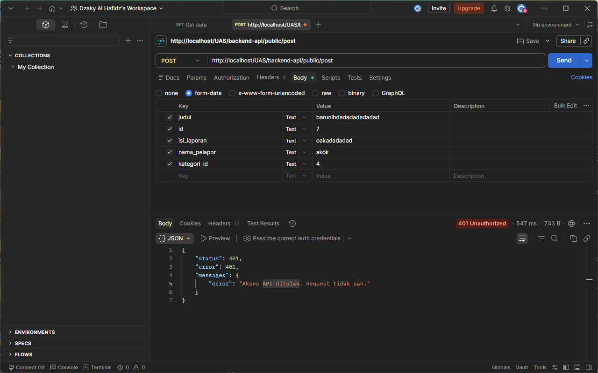

3. Antarmuka aplikasi

Login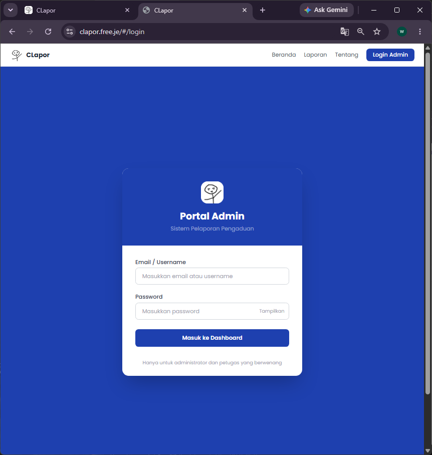

Beranda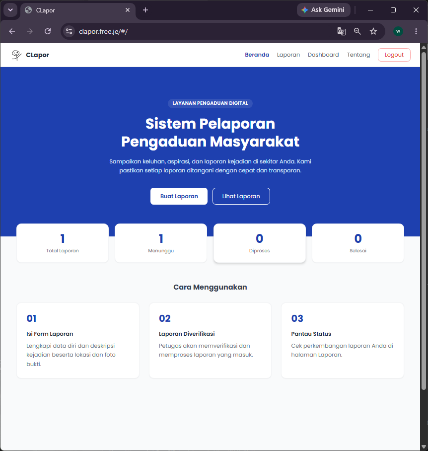

About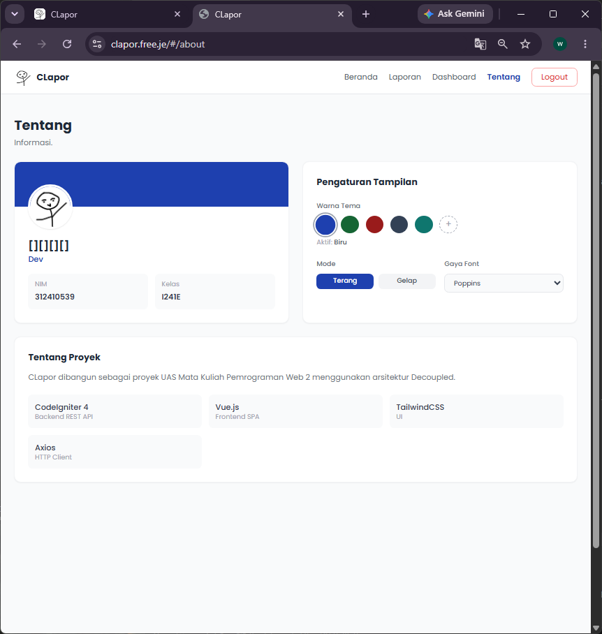

View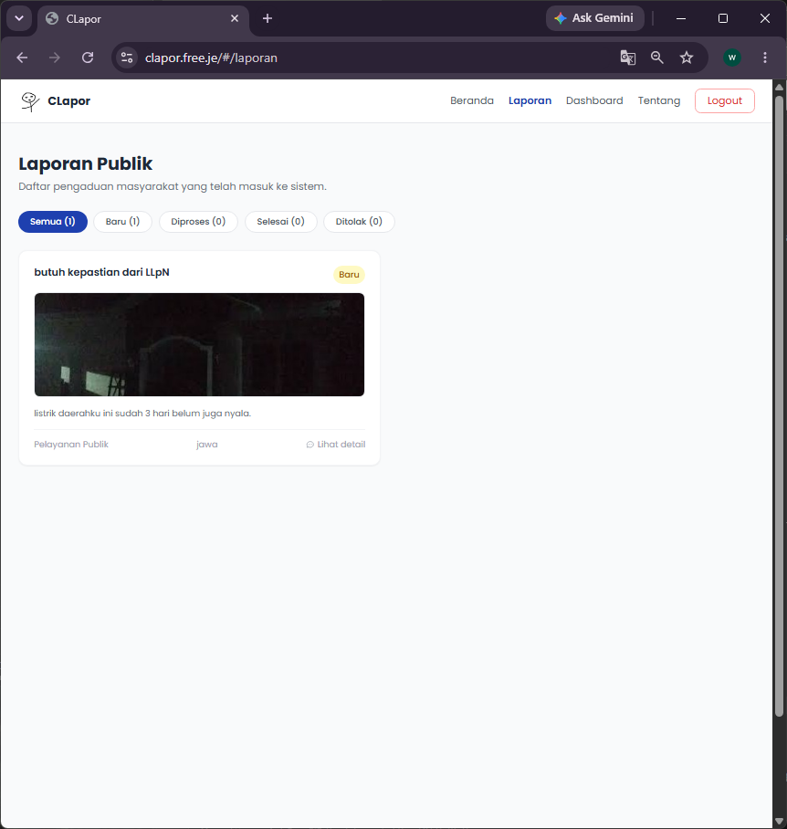

Detail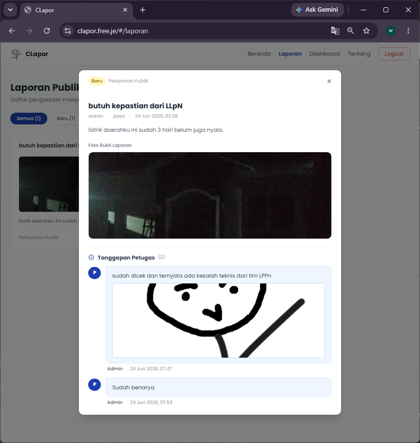

Dashboard Admin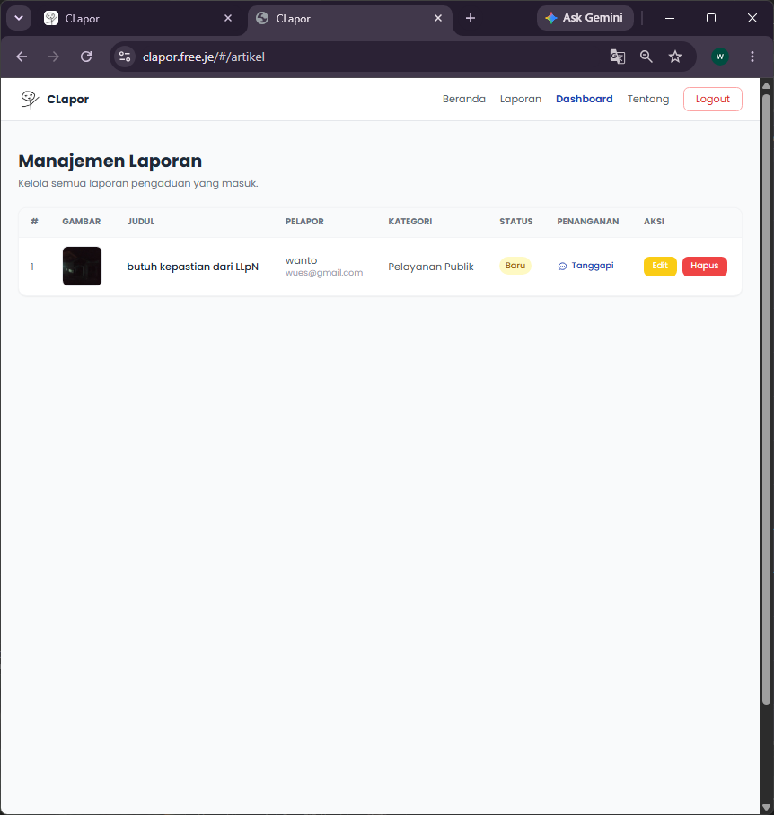

Form Tambah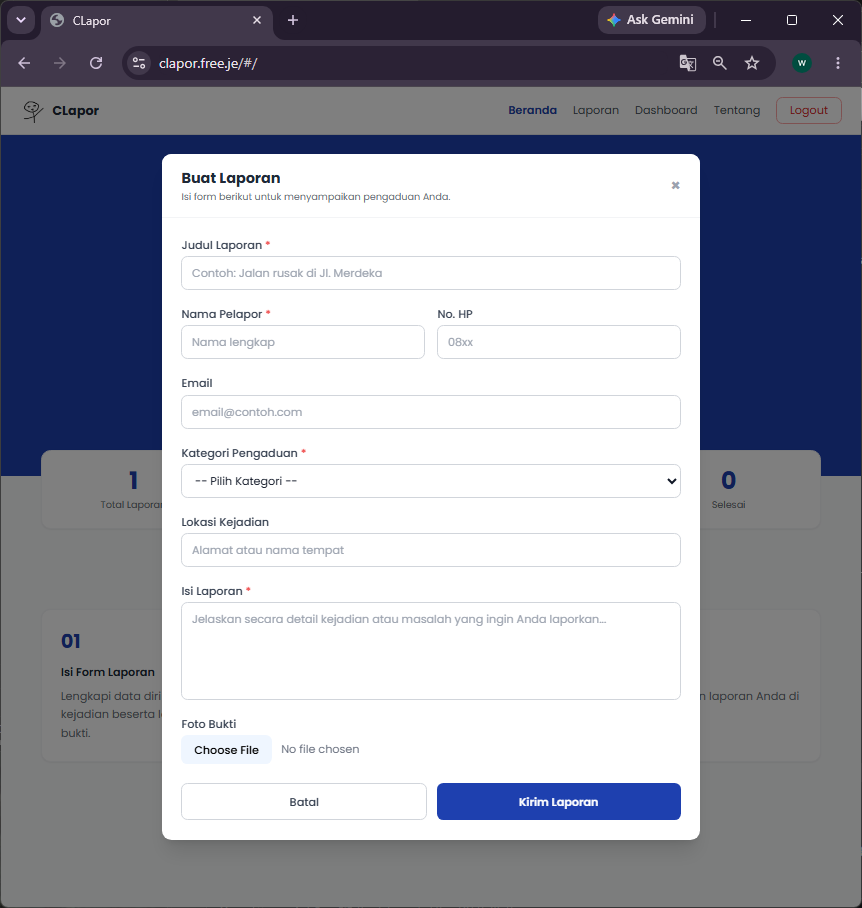

Form Edit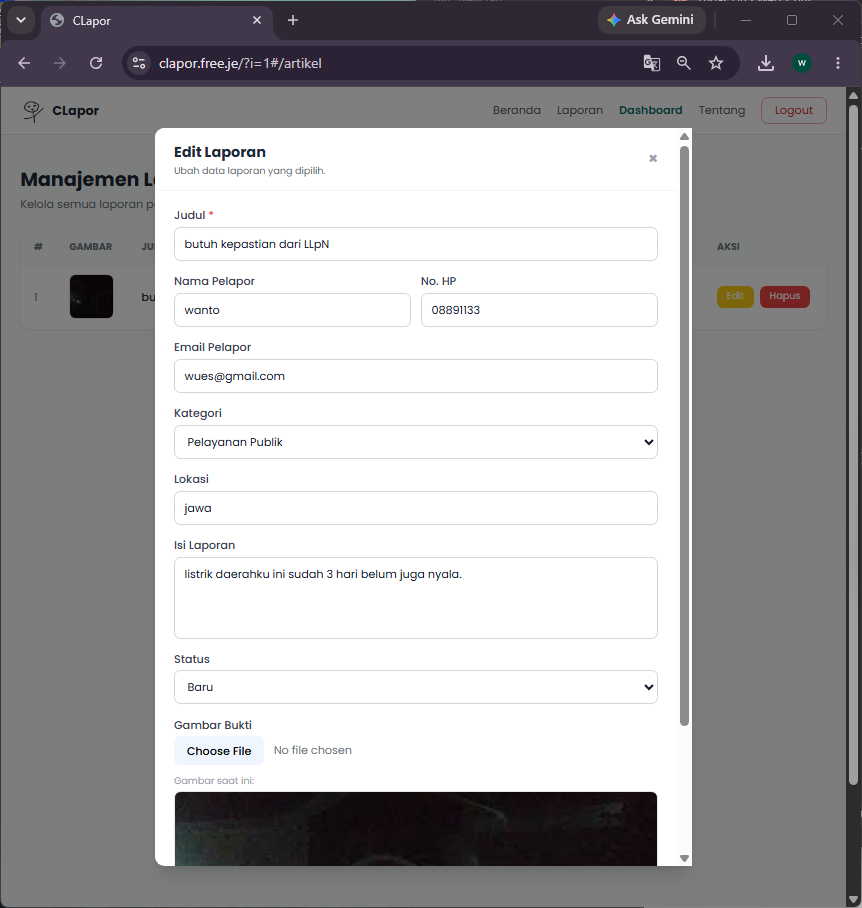


## Langkah-langkah Install

1. **Persiapan**
    - Editornya, misal Visual Studio Code.
    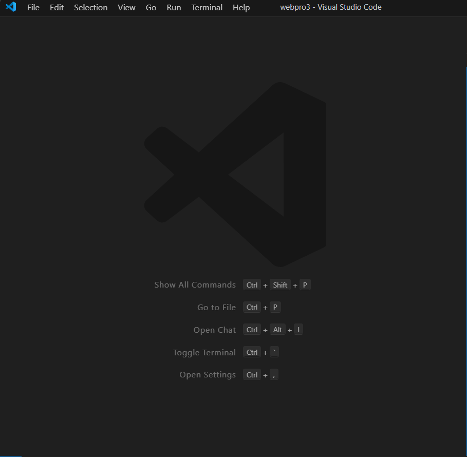
    
    - XAMPP, kalo belum punya unduh dulu di [sini](https://www.apachefriends.org/).

    - Buka XAMPP control panel dulu, aktifin ``apache`` dan ```mysql``` lalu ke ```php.ini```
     
    
    buat aktifin 
    

    - Initiall Codeigniter, silahkan unduh Codeigniter 4 terlebih dahulu, bisa melalui [composer](https://getcomposer.org/) atau [manual](https://github.com/CodeIgniter4/framework/releases/tag/v4.7.2). Kedua cara tersebut sudah terdokumentasi dalam [User Guide Codeigniter 4](https://www.codeigniter.com/user_guide/installation/index.html) jadi teman-teman bisa ikuti instruksi disana.

    - Baca [ini](https://codeigniter.com/user_guide/installation/running.html#initial-configuration) buat configurasi awal sampai set ke development mode.

    - Clone atau unduh Repo ini

2. Konfigurasi

    - Buat db trus impor [db ini](assets/db/lab_uas4.sql) ke situ, selanjutnya ubah folder .env di root untuk mengarahkan ke db baru.

    - Ganti apiurl di dalam [App.php](backend-api/app/Config/App.php), [app.js](frontend-spa/assets/js/app.js), [laporan.js](frontend-spa/assets/js/component/laporan.js) dan [artikel.js](frontend-spa/assets/js/component/artikel.js).

## External link

1. Demo Aplikasi [CLapor](https://clapor.free.je/?i=1#/)

2. Link Video [YT](https://www.youtube.com/watch?v=YXKiKKv4rvM)

## Akhir Kata

*Selamat mencoba*
